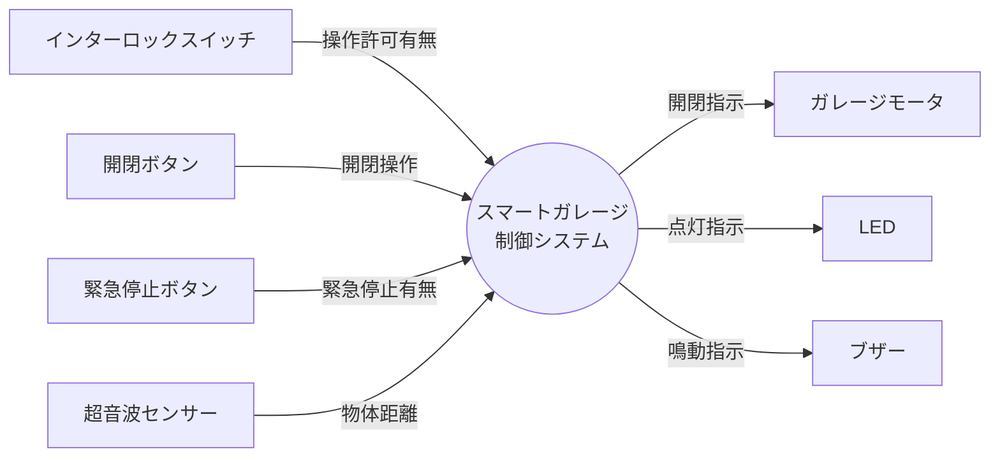

# スマートガレージ コンテキストダイアグラム

## システム名

スマートガレージ制御システム

## コンテキストダイアグラム

## 外部エンティティ一覧

| 外部エンティティ | 種別 | データフロー（方向） | データ名 |
|----------------|------|-------------------|---------|
| インターロックスイッチ | H/W（入力） | → システム | 操作許可有無 |
| 開閉ボタン | H/W（入力） | → システム | 開閉操作 |
| 緊急停止ボタン | H/W（入力） | → システム | 緊急停止有無 |
| 超音波センサー | H/W（入力） | → システム | 物体距離 |
| ガレージモータ | H/W（出力） | システム → | 開閉指示 |
| LED | H/W（出力） | システム → | 点灯指示 |
| ブザー | H/W（出力） | システム → | 鳴動指示 |
