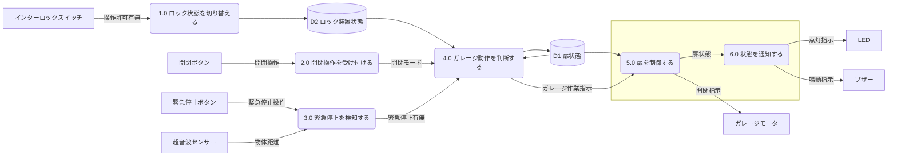

# DFD（データフロー図）

| 項目 | 内容 |
|------|------|
| バージョン | 1.0 |
| 作成日 | 2026-04-24 |
| ステータス | 初版 |

## レベル0 DFD

## プロセス一覧

| No | 種別 | プロセス名 |
|----|------|-----------|
| 1.0 | 入力系 | ロック状態を切り替える |
| 2.0 | 入力系 | 開閉操作を受け付ける |
| 3.0 | 入力系 | 緊急停止を検知する |
| 4.0 | 判断系 | ガレージ動作を判断する |
| 5.0 | 出力系 | 扉を制御する |
| 6.0 | 出力系 | 状態を通知する |

## データストア一覧

| ID | 名称 | 格納データ |
|----|------|-----------|
| D1 | 扉状態 | 扉動作状態・扉停止理由 |
| D2 | ロック装置状態 | ロック状態・アンロック状態 |
