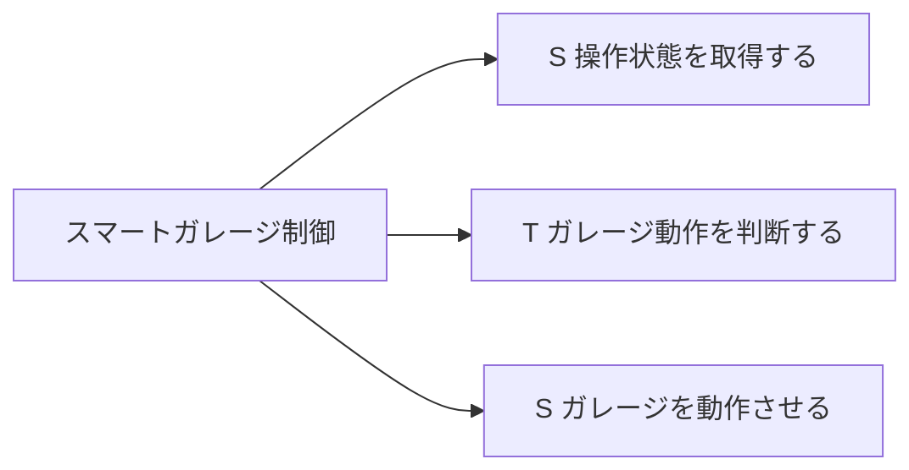

# モジュール構造図

| 項目 | 内容 |
|------|------|
| バージョン | 1.0 |
| 作成日 | 2026-04-25 |
| ステータス | 初版 |

## モジュール構造図（概要）



## モジュール構造図（詳細）

```
スマートガレージ制御 (M0)
│
├── [Source] 操作状態を取得する (MS)
│   ├── ロック装置状態を取得する (M1)
│   ├── 開閉モードを取得する (M2)
│   └── 緊急停止有無を取得する (M3)
│       ├── 緊急停止操作を読み取る (M3a)
│       └── 物体距離を読み取る (M3b)
│
├── [Transform] ガレージ動作を判断する (MT)
│
└── [Sink] ガレージを動作させる (MK)
    └── 開閉指示を送る (M5)
        └── 扉状態を通知する (M6)
            ├── LEDを点灯する (M6a)
            └── ブザーを鳴動する (M6b)
```

## モジュール一覧

| No | STS | モジュール名 | 対応DFDプロセス |
|----|-----|------------|--------------|
| M0 | — | スマートガレージ制御 | — |
| MS | Source | 操作状態を取得する | — |
| M1 | Source | ロック装置状態を取得する | P1 |
| M2 | Source | 開閉モードを取得する | P2 |
| M3 | Source | 緊急停止有無を取得する | P3 |
| M3a | Source | 緊急停止操作を読み取る | P3（緊急停止ボタン側） |
| M3b | Source | 物体距離を読み取る | P3（超音波センサー側） |
| MT | Transform | ガレージ動作を判断する | P4 |
| MK | Sink | ガレージを動作させる | — |
| M5 | Sink | 開閉指示を送る | P5 |
| M6 | Sink | 扉状態を通知する | P6（M5の出力を受け取る） |
| M6a | Sink | LEDを点灯する | P6（LED側） |
| M6b | Sink | ブザーを鳴動する | P6（ブザー側） |
